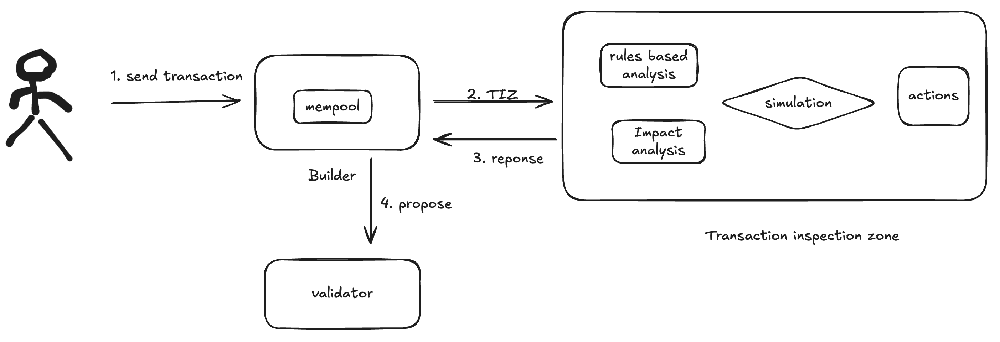

<pre>
  BEP: 467
  Title: Transaction Inspection Zone (TIZ) for Attack Detection
  Status: Draft
  Type: Information
  Created: 2024-11-20
  Author: TenArmor
  Description: An out of protocol system to detect attack transaction for block builder
  Discussions: https://forum.bnbchain.org/t/bep-idea-introduce-built-in-security-at-the-chain-level/3049
</pre>

# BEP-467: Transaction Inspection Zone (TIZ) for Attack Detection #

## Status

Draft / Proposal

## Motivation

This proposal introduces the **Transaction Inspection Zone (TIZ)**, a security layer designed for block builder to inspect all transactions within a block before they are published to validators. The TIZ will be operated on a dedicated server with a set of preconfigured rules to identify potential attacks and evaluate the impact of each transaction.

By identifing and filtering out malicious or suspicious transactions, the TIZ will protect the network and reduce the risk of attacks that are currently plaguing the whole DEFI ecosystem.

## Detailed Specification

### Overview of TIZ Operation

The TIZ operates as an **inspection layer** before transactions are sent to validators for inclusion in the blockchain. The primary function of the TIZ is to **detect malicious attack**. This is done by analyzing various information collected by simulating the transaction, TIZ consists of several components:

- **Rule-Based Detection Engine**: This engine works as a general purpose engine to detect attack by matching common attack patterns. A set of rules designed by security experts will be applied to the transaction execution call trace, example of such rules include:
  - Price manipulation.
  - Invalid access control.
  - Malicious priviledge changed.
- **Impact Analysis Engine**: This is a dedicted engine/framework to support running test code before and after calling a contract, such dynamic inspection capability offers extreme flexibity to check the state changes brought by certain contract calls:
  - Inspection code is evm compatible and can be deployed on-chain for transparency, it is protocol specific, and developed by protocol developers in their projects, something like invariant tests.
  - Protocols register their inspection code through open API, the registration let protocols decide the exact condition as to when to run their inspection code, and define the precise inspection point during the execution of a transaction.
- **Response Action Engine**: Transactions identified as potentially malicious are flagged for rejection or additional review, this engine allows user to carry out predefined actions.
  - Proactive Vulnerability Response: in the event of an attack occuring it is crucial to act as quickly as possible, to do so protocols can registers actions for different situation beforehand, such as pausing protocol, disabling transfering of funds, etc.
  - Builtin standard actions: rejecting transaction for the next block, notifying relavant parties, etc.

Once inspected, the cleared transactions are forwarded back to the block builder.

### Trust assumption

TIZ aims to provide an open platform for various third parties to collaborate in securing the blockchain. This requires the system to operate transparently. To achieve this, the system will be implemented in 2 phases(short term and long term):

- hosted by trusted organization(short-term): in this phase, the system will be hosted by a trusted reputable third-party/DAO:
  - KYC based participation: inspection engine is open to trusted individuals/organizations, and the corresponding strategies will be reviewed before getting applied.
  - Dedicated servers to run the simulation and inspection rules with restricted access to the outside world.

- use of Trusted Execution Environment(TEE): Trusted Execution Environment technology is rapidly developing in the crypto space[1][2]:
  - Dedicated TEE based hardware and software for transparency of the whole system.
    - Ensuring that only authorized and untampered software is used.
    - Allowing other blockchain participants to verify the integrity and authenticity of the inspection system.
  - Rules Update: Malicious transactions can evolve. Regular updates to detection rules, ideally through a decentralized governance mechanism, are essential.

### Trusted Party Role

The TIZ will be managed by a **trusted party** (or group), responsible for maintaining the integrity and security of the inspection layer:

- **Trusted Party Selection**: Chosen based on reputation, security track record, or community vote.
- **Governance and Oversight**: Ensuring the TIZ operates according to established security protocols and is regularly audited.
- **Transparency and Accountability**: Ensuring the operation of the TIZ is transparent to the community, with open access to inspection logs and reports.

## Rationale

The introduction of the Transaction Inspection Zone (TIZ) adds an additional layer of scrutiny to prevent malicious transactions from being included. Compared to off-chain attack detection, TIZ offers the advantage of providing more reliable guarantees for attack prevention:

- **Early Detection**: TIZ works alongside the block builder to identify threats at an earlier stage.
- **Reliable Response**: Response actions can be executed in a more dependable manner.

This reduces risks to the blockchain ecosystem and helps improve the overall security and reliability of BSC.

## Potential Challenges

- **Scalability**: The TIZ inspection process could potentially introduce delays in block production times, especially under high network traffic. Further optimizations would be needed to ensure scalability.
- **Centralization**: Depending on the implementation, there could be concerns around centralization if a single party operates the TIZ. To address this, a decentralized or multi-party governance model for the TIZ could be considered.
- **Trust in the Third Party**: Ensuring the TIZ is genuinely trusted and not a potential vector for attack is critical. A transparent auditing and review process must be in place.

## Conclusion

The creation of a Transaction Inspection Zone (TIZ) is an essential step toward improving the security, transparency, and reliability of the Binance Smart Chain network. By introducing a trusted party-operated mechanism to inspect and validate transactions before they reach validators, we can prevent a wide range of attack vectors and ensure that only legitimate transactions are included in the blockchain. This proposal represents a proactive approach to securing the future of the BSC ecosystem.

## References

1. https://arxiv.org/pdf/2206.03780
2. https://collective.flashbots.net/t/tee-wiki/2019
